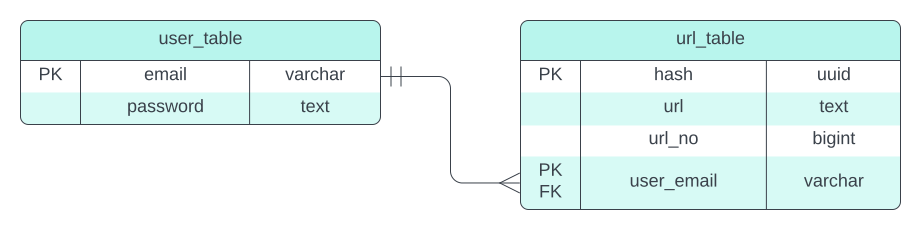
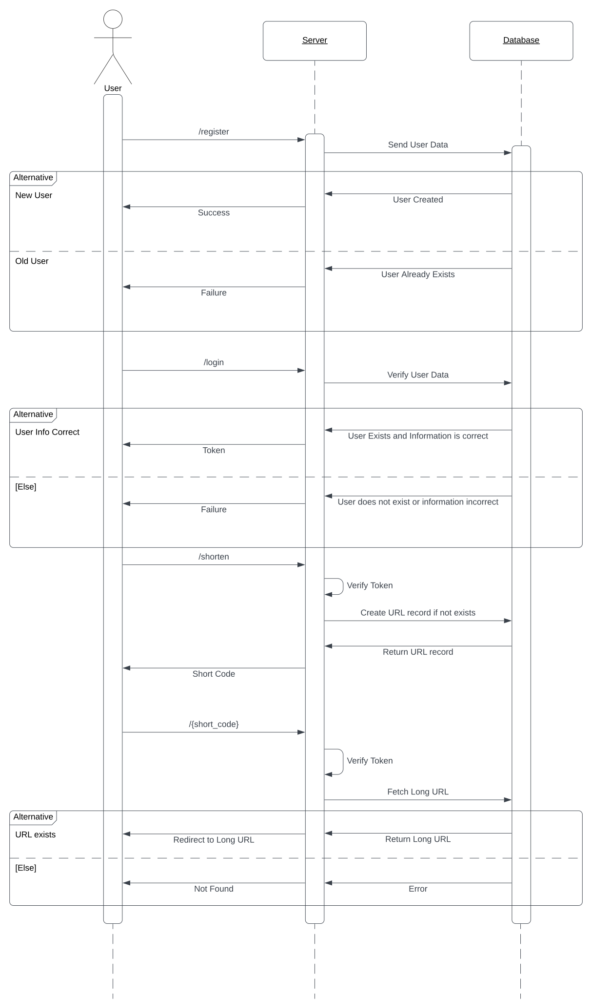

# URL Shortener:
A URL shortener converts a long URL into a shorter version, making it easier to share. This is particularly helpful on social media platforms where character limits are imposed on posts.

## Assumptions:

 - A URL created will never expire.
 - Every user will have a unique short URL for the same website.
 - Only the user who has created a short URL can use it
 - The short-code generated is as small as possible.
 - Ability to store large number of URLs. 

## API:

 - `/register`: 
	 > Method: POST
	 >
	 > Request Body: `{"email": "user@example.com","password":"string"}`
	 >
	 > Responses: 201 (CREATED), 409 (CONFLICT)
	 
	 Registers a user. 
	 If successful returns 201, otherwise if user already exists returns 409.

- `/login`:
	 > Method : POST
	 >
	 > Request Body: `{"email": "user@example.com","password":"string"}`
	 >
	 > Responses: 200 (OK), 403 (Forbidden)
	 >
	 > Response Body: `{"token:"token"}`
	 >
	 
	Logs a user in and sends back an access token if user information is correct else sends a response of 403.

- `/shorten`
	 > Method: POST
	 >
	 > Request Body: `{"url":"www.example.com"}`
	 >
	 > Responses: 201 (CREATED)
	 >
	 > Response Body: `{"url":"www.example.com/h758h6"}`
	 >
	 > Header: `Authorization: Bearer <token>` 
	 
	Takes a long URL in request body and returns a shortened URL
- `/{short_code}`
	 > Method: GET
	 >
	 > Responses: 303 (SEE OTHER), 404 (NOT FOUND)
	 >
	 > Header: `Authorization: Bearer <token>` 
	
	Consumes a shortened URL and redirects to long URL pointed by it.

## Database Design

## Application Flow

## Methodology

- URLs are stored in a table with URL hash, a URL number, the long URL and the user who has created the URL
- A records uniqueness is based on the URL hash and the user's email. MD5 is used to hash the URL as it is a proven algorithm
- Each record has a unique URL number associated with it generated by a sequence (`url_seq`) which is used to generate a short code.
- Short code generation is done by using base62 encoding algorithm. The `url_seq` generates number which are then encoded using base62 algorithm.
- When a short code is sent to the server it is decoded and its existence checked in the user table.
- As base62 is one-to-one mapping this ensures that all short codes are universally unique.

## Working
- Users have to first register with the server to create short URLs. 
- Users are stored in the database with an email and a password field.
- Once user data is received the server firsts checks the database for the user's existence. 
- If user already exists, then a 409 (CONFLICT) status code is sent back.
- Else user record is created in database.
- The user's data is then sent to the login endpoint where the server checks if the information supplied is correct, if correct, a JWT token is returned to the user.
- Once logged in, the user then can send the URL it wants shortened.
- A new record is created based on the URL and the user.  A short code is sent based on the assigned URL number which is encoded and sent back to the user.
- When a user visits a short URL, the short code embedded is decoded and the user redirected to the original URL.

## How to run

 - In the root folder first create a python virtual environment.
						
		python -m venv ./venv
 -  Once virtual environment is created and sourced install all dependencies using:
 
		 pip install -r .\requirements.txt
 -  Run fastapi server using:
 
		 fastapi run
 - The server should now be accessible at localhost:8000

	
